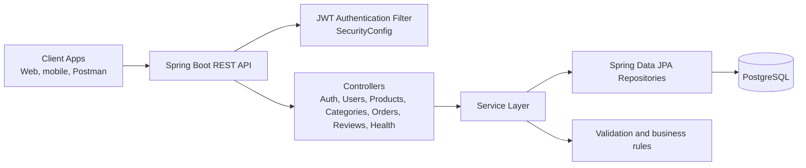
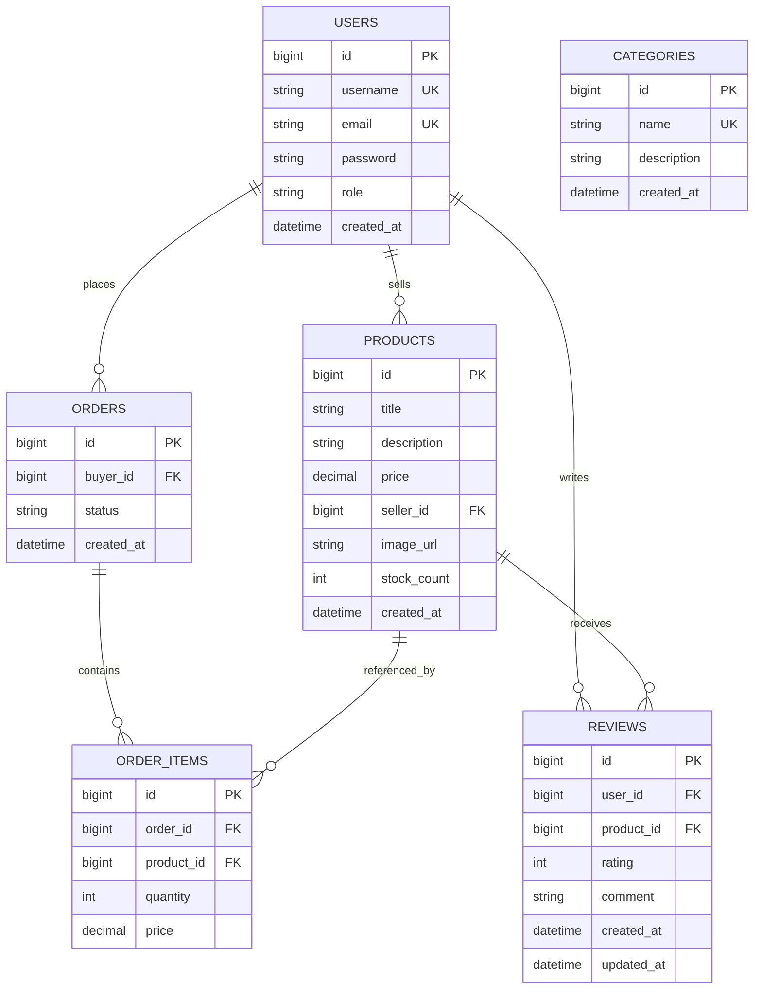

# Mini Marketplace

Mini Marketplace is a Spring Boot REST API for a small marketplace domain with JWT authentication, role-based access control, PostgreSQL persistence, and Docker-friendly deployment.

## Project Description

The application supports user registration and login, product listing and search, order placement and management, category administration, and product reviews. The security model is stateless and token-based, with public read access for catalog data and restricted write access for authenticated users, owners, and admins.

## Architecture Diagram



Browser-viewable diagram page: [docs/mini-marketplace-diagrams.html](docs/mini-marketplace-diagrams.html)

Editable diagram source: [docs/mini-marketplace-diagrams.drawio.xml](docs/mini-marketplace-diagrams.drawio.xml)

## ER Diagram



Browser-viewable diagram page: [docs/mini-marketplace-diagrams.html](docs/mini-marketplace-diagrams.html)

## API Endpoints

| Area | Method | Path | Access | Purpose |
|---|---|---|---|---|
| Auth | POST | /api/auth/register | Public | Register a new user |
| Auth | POST | /api/auth/login | Public | Authenticate and return JWT |
| Auth | GET | /api/auth/me | Authenticated | Read the current authenticated user |
| Users | GET | /api/users/me | Authenticated | Read the current profile |
| Users | PUT | /api/users/me | Authenticated | Update the current profile |
| Users | GET | /api/users | Admin | List all users |
| Users | GET | /api/users/{id} | Admin | Get a user by ID |
| Users | PUT | /api/users/{id}/role | Admin | Change a user role |
| Users | DELETE | /api/users/{id} | Admin | Delete a user |
| Categories | GET | /api/categories | Public | List categories |
| Categories | GET | /api/categories/{id} | Public | Get category by ID |
| Categories | POST | /api/categories | Admin | Create a category |
| Categories | PUT | /api/categories/{id} | Admin | Update a category |
| Categories | DELETE | /api/categories/{id} | Admin | Delete a category |
| Products | GET | /api/products | Public | List all products |
| Products | GET | /api/products/{id} | Public | Get product by ID |
| Products | GET | /api/products/seller/{sellerId} | Public | List products by seller |
| Products | GET | /api/products/search?title=... | Public | Search products by title |
| Products | GET | /api/products/my | Authenticated | List current seller products |
| Products | POST | /api/products | Authenticated | Create a product |
| Products | PUT | /api/products/{id} | Authenticated | Update a product |
| Products | DELETE | /api/products/{id} | Authenticated | Delete a product |
| Orders | POST | /api/orders | Authenticated | Place an order |
| Orders | GET | /api/orders/my | Authenticated | List current buyer orders |
| Orders | GET | /api/orders/{id} | Authenticated | Get an order by ID |
| Orders | PUT | /api/orders/{id}/cancel | Authenticated | Cancel an order |
| Orders | GET | /api/orders/seller-orders | Authenticated | List orders containing seller products |
| Orders | PUT | /api/orders/{id}/status | Authenticated | Update order status |
| Orders | GET | /api/orders | Admin | List all orders |
| Orders | PUT | /api/orders/{id}/complete | Admin | Mark an order completed |
| Reviews | GET | /api/reviews/product/{productId} | Public | List reviews for a product |
| Reviews | GET | /api/reviews/product/{productId}/summary | Public | Get review summary |
| Reviews | GET | /api/reviews/my | Authenticated | List current user reviews |
| Reviews | POST | /api/reviews | Authenticated | Create a review |
| Reviews | PUT | /api/reviews/{id} | Authenticated | Update a review |
| Reviews | DELETE | /api/reviews/{id} | Authenticated | Delete a review |
| Health | GET | /api/health | Public | Basic health check |
| Health | GET | /api/health/detailed | Public | Detailed health info |
| Health | GET | /api/health/live | Public | Liveness probe |
| Health | GET | /api/health/ready | Public | Readiness probe |

## Run Instructions

### Local Development

1. Start PostgreSQL on port 5433, or point SPRING_DATASOURCE_URL at your own database.
2. Set JWT_SECRET if you want to override the default development secret.
3. Run the application:

```bash
./mvnw spring-boot:run
```

The default application port is 8083, so the API is available at http://localhost:8083/api.

### Docker Compose

```bash
docker compose up postgres -d
./mvnw spring-boot:run
```

For full containerized stack:

```bash
docker compose --profile full-stack up --build
```

### Health Check

```bash
curl http://localhost:8083/api/health
```

## CI/CD Explanation

The repository uses GitHub Actions workflows:

1. .github/workflows/ci.yml runs on every push and pull request. It starts a PostgreSQL 13 service, configures a test application.yaml, runs Maven tests, generates reports, and builds the application jar if tests pass.
2. .github/workflows/keep-alive.yml pings the deployed health endpoint on schedule so the Render instance stays warm.

This provides automatic verification on every change, build artifacts for successful runs, and uptime protection for the hosted instance.

## Project Structure

```text
├── src/                    Source code
├── docs/                   Documentation and diagrams
├── scripts/                Utility scripts
├── sql/                    Database helper scripts
├── docker-compose.yml      Docker services
├── Dockerfile              Application container image
└── pom.xml                 Maven build configuration
```

## Technology Stack

- Spring Boot 3.3.2
- Spring Security with JWT
- Spring Data JPA
- PostgreSQL 13
- Maven
- Docker and Docker Compose
- Java 17

## Related Documentation

- [Docker setup guide](docs/DOCKER_SETUP.md)
- [Database schema notes](docs/DATABASE_SCHEMA.md)
- [REST API design reference](docs/REST_API_DESIGN.md)
- [Review API testing summary](REVIEW_API_TEST_SUMMARY.md)
- [Review manual testing guide](REVIEW_API_MANUAL_TESTING.md)

## Team Members

- Student ID: 2107029, 2107027